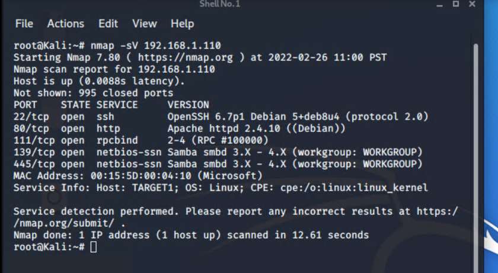
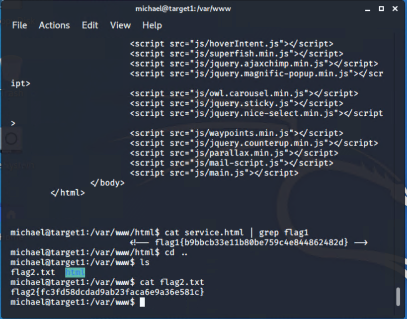
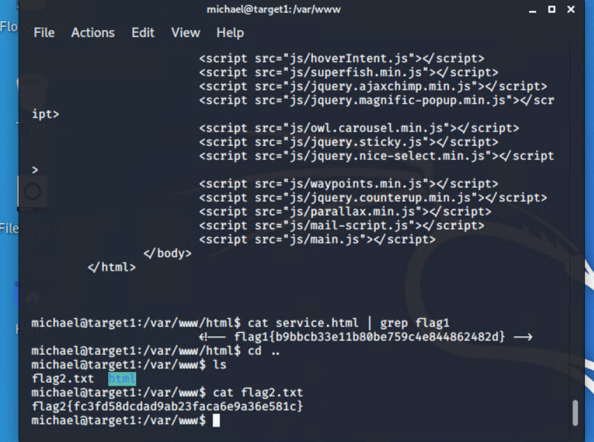

# Red Team: Summary of Operations

## Table of Contents
- Exposed Services
- Critical Vulnerabilities
- Exploitation

### Exposed Services

Nmap scan results for each machine reveal the below services and OS details:
```bash
$ nmap -sV 192.168.1.110  
```
   
This scan identifies the services below as potential points of entry:
- Target 1
  - 22/tcp          open ssh         OpenSSH 6.7p1 Debian 5+deb8u4 
  - 80/tcp          open http        Apache httpd 2.4.10 ((Debian))
  - 111/tcp         open rpcbind     2-4 (RPC #100000)
  - 139/tcp         open netbios-ssn Samba smbd 3.X - 4.X (workgroup: WORKGROUP) 
  - 445/tcp         open netbios-ssn Samba smbd 3.X - 4.X (workgroup: WORKGROUP) 


The following vulnerabilities were identified on each target:
- Target 1
  - Critical Vulnerability 1: Weak password was exploited; such as Michael's password being michael and Steven's password being easily cracked by John The Ripper. 
  - Critical Vulnerability 2: Identified the users Michael and Steven
  - Critical Vulnerability 3: Michael contained the same password as username
  - Critical Vulnerability 4: MySQL Server login contained the login credentials in wp-config.php file in plain text. 
  - Critical VUlnerability 5: The user Steven was able to execute python code to escalate his priveleges to root.

### Exploitation

The Red Team was able to penetrate `Target 1` and retrieve the following confidential data:
- Target 1
  - `flag1.txt`: b9bbcb33e11b80be759c4e844862482d

    - **Exploit Used**
      - viewing the page source code, then guessing Michael's password, then ssh into the user Michael.  
      - cat service.html | grep flag1 
  - `flag2.txt`: fc3fd58dcdad9ab23faca6e9a36e581c

    - **Exploit Used**
      - Guessed Michael's password is the same as username and ssh into the server. 
      - ssh into michael@192.168.1.110 and used password: michael 
      
